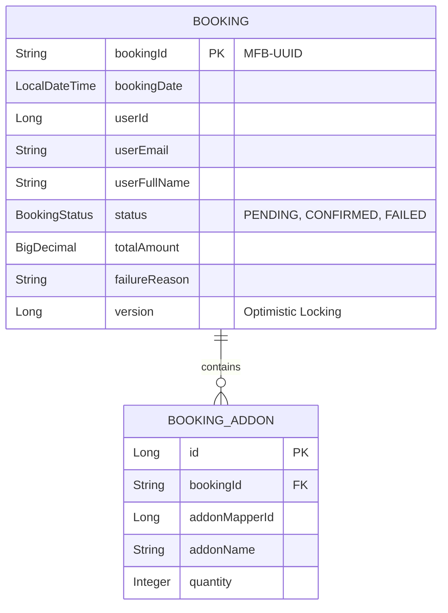
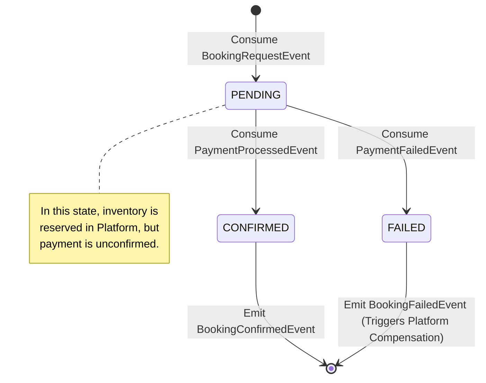

# PHASE 2: Booking Microservice - Domain & Architecture

## 1. Service Ownership and Bounded-Context Documentation

### Bounded Context
The **Booking Service** operates within the *Booking Lifecycle and Fulfillment* bounded context. It takes over the booking saga after the Platform/Core Service successfully validates catalog rules, checks availability, and reserves the capacity.

### Domain Ownership Boundaries
*(Verified against the `com.forvmom.MomentForeverBooking` repository)*

**Strictly Owned by Booking Service:**
- **The Booking Aggregate (`Booking.java`):** Represents the definitive state of a user's transaction (spanning creation, payment, and completion).
- **Booking State Machine (`BookingStatus.java`):** Controls transitions (`PENDING`, `CONFIRMED`, `FAILED`, `CANCELLED`).
- **Payment Orchestration:** Dispatches the `PaymentRequestedEvent` to instruct the Payment Service.
- **Deduplication (Inbound Inbox):** Safeguards the state machine from duplicate Kafka messages (e.g., handling duplicate `PaymentProcessedEvent`s idempotently).
- **Terminal Decision:** Decides when a booking is officially confirmed or permanently failed.
- **Compensation Initiation:** If the payment fails, the Booking Service transitions to `FAILED` and publishes the `BookingFailedEvent`.

**Strictly Excluded / Delegated (Not Owned):**
- **Catalog & Inventory:** The Booking service makes NO database changes to capacity limits, slots, or catalog metadata. This is owned by Platform/Core.
- **Capacity Release:** When a booking fails, the Booking Service does *not* execute an SQL UPDATE on inventory. Instead, it emits the `BookingFailedEvent`, which the Platform/Core Service consumes to perform the actual capacity release.
- **Payment Execution:** It does not interact with Stripe/PayPal. It only emits requests and listens for results from the Payment Service.

---

## 2. Architecture Overview

The Booking Service acts as a robust, event-driven state machine. It uses the **Saga Choreography / Orchestration hybrid** pattern (acting as a local orchestrator for the payment step, while participating in the broader platform choreography).

**Key Architectural Components:**
- **Inbound Event Processors (`BookingRequestProcessor`, `PaymentProcessedProcessor`, `PaymentFailedProcessor`):** Translators that consume domain events and apply business rules.
- **Inbox Pattern (`InboundOutbox` entity):** Guarantees exactly-once processing of incoming messages.
- **Transactional Outbox (`OutgoingOutboxRecord` entity):** Guarantees at-least-once delivery of outgoing messages (like `PaymentRequestedEvent`).
- **Quartz Schedulers:** Independent, distributed background workers (`OutgoingOutboxPublisherJob`, `OutboxRetriesJob`) that ensure eventual consistency without blocking the main event consumption threads.

---

## 3. Domain Model

The core aggregate root is `Booking`. It is highly normalized for fast writes and state transitions.

*Note on Optimistic Locking:* The `Booking` entity includes `@Version private Long version;`. Any concurrent attempts to transition the status of a booking (e.g., a delayed Payment Success arriving at the exact same time as a Payment Timeout Failure) will be guarded by JPA Optimistic Locking, rolling back the loser.

---

## 4. Complete Booking Lifecycle

1. **Initiation (Platform -> Booking):** 
   - Platform/Core successfully reserves capacity and fires `BookingRequestEvent`.
   - `BookingRequestConsumer` (Kafka Listener) receives it.
   - `BookingRequestProcessor` checks for duplicates, creates the `Booking` in `PENDING` state, and creates an outgoing `PaymentRequestedEvent`. All in one ACID transaction.
2. **Payment Orchestration (Booking -> Payment):**
   - Quartz job reads the Outbox and fires `PaymentRequestedEvent` to Kafka.
3. **Payment Resolution (Payment -> Booking):**
   - Payment Service completes authorization and fires either `PaymentProcessedEvent` or `PaymentFailedEvent`.
4. **Terminal State & Compensation (Booking -> Platform):**
   - **Success Path:** `PaymentProcessedProcessor` transitions booking to `CONFIRMED` and drops a `BookingConfirmedEvent` in the Outbox.
   - **Failure Path:** `PaymentFailedProcessor` transitions booking to `FAILED`, resolves the failure reason, and drops a `BookingFailedEvent` in the Outbox. Platform listens to this event to release the capacity.

---

## 5. Booking State Machine

- **PENDING:** The initial state. Indicates the intent to book is valid and capacity is held, but financial clearing is required.
- **CONFIRMED:** The happy path terminal state. Payment cleared.
- **FAILED:** The failure terminal state. Payment declined or timed out.
- **CANCELLED:** A manual/user-initiated terminal state post-confirmation (handled via separate flows).

*Verification:* The transitions are strictly controlled by `BookingStatusTransitionService.java` executing custom repository JPQL queries (`transitionPendingBookingToConfirmed`, etc.) to ensure that only `PENDING` bookings can be transitioned, preventing invalid state jumps (e.g., `FAILED` -> `CONFIRMED`).