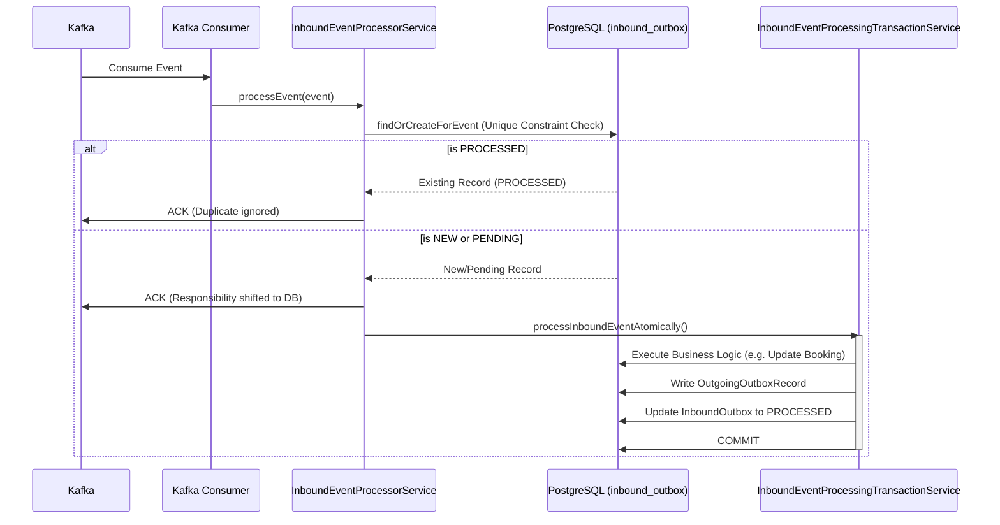
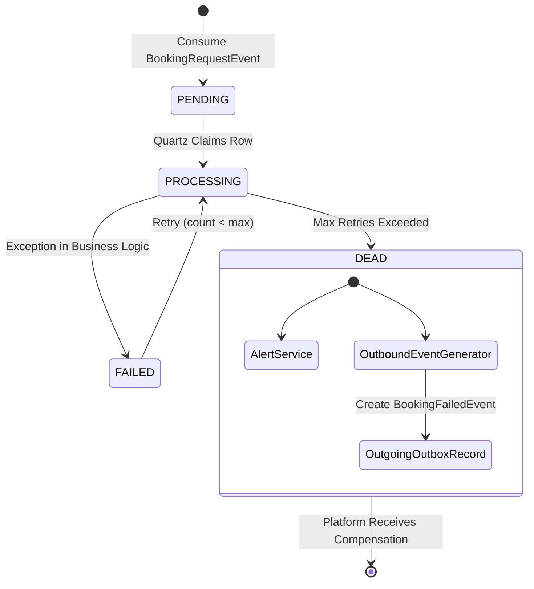

# PHASE 3: Booking Microservice - Event Deduplication & Coordination

## 1. Kafka Event Catalogue
The Booking Microservice acts as a router/orchestrator in the center of the event topology.

**Inbound (Consumed) Events:**
- `BookingRequestEvent` (`topic_booking_requested`): Triggered by Platform after inventory reservation.
- `PaymentProcessedEvent` (`topic_payment_processed`): Triggered by Payment Service on successful charge.
- `PaymentFailedEvent` (`topic_payment_failed`): Triggered by Payment Service on declined charge.

**Outbound (Produced) Events:**
- `PaymentRequestedEvent` (`topic_payment_requested`): Instructs the Payment Service to collect funds.
- `BookingConfirmedEvent` (`topic_booking_confirmed`): Informs downstream services (e.g. Notifications) of success.
- `BookingFailedEvent` (`topic_booking_failed`): Instructs the Platform to release reserved inventory.

*Cross-Repository Verification Note:* Ensure the actual Kafka topics in configuration (`BookingKafkaConfig`) align with the topics defined in the Platform and Payment services.

## 2. Event Deduplication and Inbox Documentation

### The Problem
Kafka guarantees at-least-once delivery. If the Booking Service processes a `PaymentProcessedEvent`, updates the Booking status to `CONFIRMED`, and then crashes before acknowledging the offset to Kafka, Kafka will re-deliver the event. Processing it again could trigger duplicate confirmation emails or corrupt internal state.

### The Inbox Implementation (`InboundOutbox`)
The Booking Service solves this using an **Inbound Outbox** (commonly called an Inbox or Deduplication table).

When a Kafka listener (`BookingRequestConsumer`, etc.) receives an event, it delegates to `InboundEventProcessorService.java`:
1. **Find or Create Inbox Record:** `inboundOutboxService.findOrCreateForEvent(event)` is called.
2. **Duplicate Guard:** The `InboundOutbox` entity enforces unique constraints on the database level:
   - `uq_inbound_outbox_booking_event`: `(booking_ref_id, event_type)` - Ensures only one event of a specific type (e.g., only one `BOOKING_REQUESTED`) is processed per booking.
   - `uq_inbound_outbox_producer_event`: `(producer, event_id)` - A strict idempotency guard checking the origin's unique event ID.
3. **Early ACK:** If the status is already `PROCESSED`, the code logs *"Duplicate event ignored"* and safely ACKs Kafka immediately.
4. **Immediate ACK on First Read:** `acknowledgment.acknowledge()` is called *before* the business logic executes. This moves the reliability burden entirely from Kafka retries to the local database, relying on Quartz (`OutboxRetriesJob`) to recover if the business logic crashes mid-flight.

## 3. Payment Coordination Documentation

The Booking Service acts as a lightweight Saga Orchestrator for the payment step.
1. **Initiation:** The `BookingRequestProcessor` creates the `Booking` (status = `PENDING`) and simultaneously creates a `PaymentRequestedEvent` in the `OutgoingOutboxRecord` table.
2. **Waiting:** The service pauses processing for this booking. It is entirely decoupled from the Payment Service API.
3. **Success Path:** When `PaymentProcessedEvent` arrives, `PaymentProcessedProcessor` triggers `BookingStatusTransitionService.transitionPendingBookingToConfirmed(bookingId)`.
4. **Failure Path:** When `PaymentFailedEvent` arrives, `PaymentFailedProcessor` triggers `transitionPendingBookingToFailed`.

*Note:* All outbound communication is routed through `outgoingOutboxService.createRecord()`, ensuring no dual-write vulnerabilities.

## 4. Booking Failure and Compensation Documentation

If a booking fails, the system must compensate the upstream Platform Service (which is holding the locked inventory).

**Failure Scenarios & Compensations:**
1. **Payment Rejected:** `PaymentFailedProcessor` transitions booking to `FAILED` and writes a `BookingFailedEvent` to the outgoing outbox. The Platform Service consumes this and releases the inventory.
2. **Poison Message (Dead Letter Handler):** What happens if the `BookingRequestEvent` itself is structurally invalid and fails processing 5+ times? 
   - `OutboxDeadLetterHandler.java` marks the inbox record as `DEAD`.
   - It fires an administrative alert via `AlertService`.
   - **Crucially:** It synthesizes a `BookingFailedEvent` (reason: "Booking request permanently failed after max retries") and puts it in the Outgoing Outbox. This guarantees the Platform Service gets the compensation signal even if the Booking Service could never parse the original request.
3. **Payment Success but Booking Fails:** If `PaymentProcessedEvent` hits a Dead Letter state (e.g. database constraints prevent transitioning to `CONFIRMED`), `OutboxDeadLetterHandler` intercepts it and creates a `RefundRequestEvent` (or sends a high-priority manual alert) to ensure the user gets their money back.

## 5. Duplicate, Concurrent, Conflicting, and Out-of-Order Event Scenarios

- **Duplicate Event:** Intercepted by `inbound_outbox` unique constraints. Second event is ignored.
- **Concurrent Identical Events:** Two threads attempt to insert the same `inbound_outbox` row. PostgreSQL throws a `ConstraintViolationException` on the second thread.
- **Conflicting State Transitions:** `PaymentProcessedEvent` and `PaymentFailedEvent` arrive simultaneously (e.g., due to a race condition upstream). `BookingStatusTransitionService` uses JPA Optimistic Locking (`@Version` on `Booking`). The first thread updates the status to `CONFIRMED` and increments the version. The second thread attempts to update to `FAILED`, sees a version mismatch, throws `ObjectOptimisticLockingFailureException`, and rolls back. The Inbox retry mechanism will catch it, and on the next loop, the state is already `CONFIRMED`, so the failed event logic will safely abort.
- **Out-of-Order Events:** If `PaymentProcessedEvent` arrives *before* the `BookingRequestEvent`, the `InboundEventProcessingTransactionService` will fail because the `Booking` does not exist in the database yet. The inbox record transitions to `FAILED` and Quartz will retry it later. By the time Quartz retries it, the `BookingRequestEvent` will likely have been processed, allowing the system to self-heal.

## 6. Related Mermaid Diagrams

### Inbound Deduplication & Execution Flow

### Dead Letter Compensation Flow
