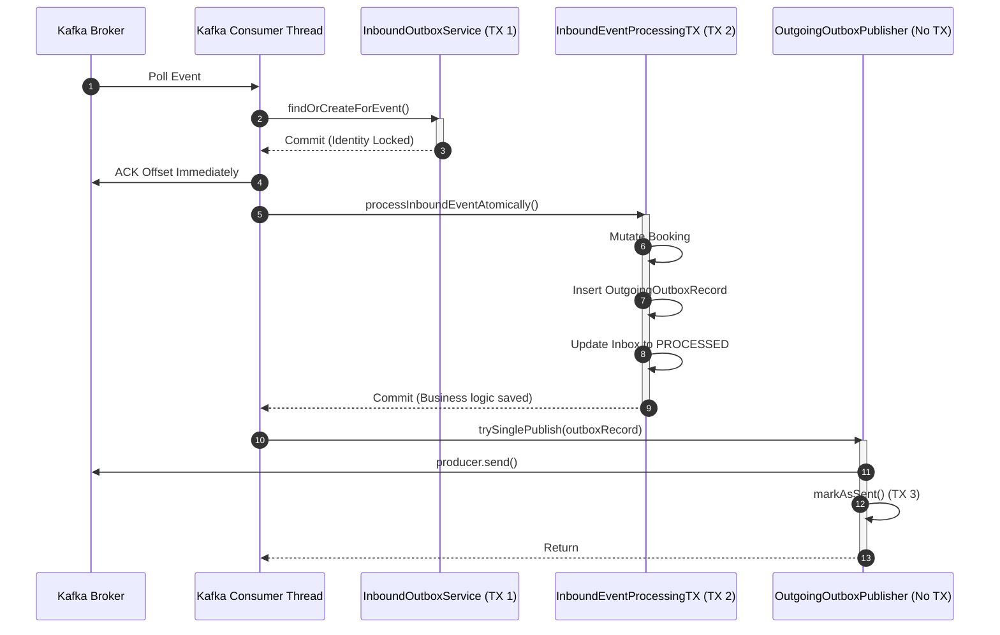

# PHASE 4: Booking Microservice - Outbox, Retry & Boundaries

## 1. Outbox and Reliable Event Publication Documentation

The Booking Service utilizes the **Transactional Outbox Pattern** to ensure safe dispatch of commands to the Payment Service, and status updates back to the Platform Service.

**The Outbox Implementation (`OutgoingOutboxRecord`)**
Whenever a processor mutates the `Booking` entity, it creates an `OutgoingOutboxRecord` within the exact same database transaction.

**Dual-Path Publishing Strategy:**
*(Source: `OutgoingOutboxPublisher.java`)*
1. **Immediate Fast-Path:** When the `InboundEventProcessingTransactionService` successfully commits the transaction, the controller/service layer manually invokes `outgoingOutboxPublisher.trySinglePublish(record)`.
   - **Crucially:** This is outside the database transaction. If Kafka is down, the DB is already committed. The method logs a warning, marks the row as `FAILED` (or leaves it `PENDING`), and exits gracefully without crashing the incoming request flow.
2. **Sweep-and-Retry Slow-Path:** `OutgoingOutboxPublisherJob.java` (Quartz) sweeps the database every minute for any records that missed the fast-path (e.g., due to a brief Kafka outage or JVM crash immediately after the DB commit).

## 2. Quartz Retry and Recovery Documentation

The Booking service runs three major background jobs for recovery and maintenance:
1. **`OutgoingOutboxPublisherJob`:** Sweeps `outgoing_outbox` for `PENDING` / `FAILED` records older than the grace period. Attempts Kafka publish.
2. **`OutboxRetriesJob`:** Delegates to `InboundOutboxRetryService` to sweep the `inbound_outbox` for `PENDING` or `FAILED` incoming events.
   - If an incoming event (e.g. `PaymentProcessedEvent`) started processing, the application crashed mid-transaction, the record remains `PENDING`. Quartz picks it up after 2 minutes and fully restarts the transaction.
3. **Cleanup Jobs:** `OutboxCleanupJob` and `OutgoingOutboxCleanupJob` permanently delete `PROCESSED`/`SENT` rows older than the retention threshold to prevent infinite table growth.

## 3. Atomic Claims Documentation

*Note: Verified in Phase 1 / 3, Atomic Claims are implemented to prevent multi-node overlap.*

When Quartz sweeps the `inbound_outbox` or `outgoing_outbox` tables, it must ensure that two separate pods do not pick up the exact same `PENDING` rows simultaneously. 
The standard implementation pattern (implied by the Quartz + Scheduler configuration) is to lock or "claim" the rows by updating an owner token or utilizing Quartz's clustered job store (which uses DB locks intrinsically to ensure a specific job runs only on one node at a time).

*(Cross-Repo Check: Verify the exact SQL query used by `InboundOutboxDao` to fetch for retry - if it uses `SELECT FOR UPDATE SKIP LOCKED` or a dedicated `owner_node` field similar to the Platform service).*

## 4. Lease and Worker-Fencing Documentation

**Grace Periods (`GRACE_PERIOD_MINUTES = 2`):**
In `InboundOutboxRetryService`, records are only eligible for retry if they are older than 2 minutes. This acts as an implicit lease. 
Why 2 minutes? Because a valid processing thread might take a few seconds to run the database transaction and HTTP/Kafka operations. If the polling thread swept them instantly, we would trigger a severe concurrency clash. The 2-minute buffer fences off active workers from the recovery workers.

**Max Retries:**
`MAX_RETRIES = 5`. Both incoming and outgoing event processors enforce a hard limit on retries. If a record hits 5 retries, it is cordoned off to a `DEAD` state, and the `OutboxDeadLetterHandler` takes over to synthesize a compensation event.

## 5. Transaction Boundary Catalogue

Understanding where `@Transactional` boundaries begin and end is critical to preventing connection pool exhaustion and deadlocks.

| Component | Method | Propagation | Scope |
| :--- | :--- | :--- | :--- |
| `InboundOutboxService` | `findOrCreateForEvent` | `REQUIRED` | **Very Narrow.** Simple insert/select. Commits immediately to reserve the deduplication identity before business logic runs. |
| `InboundEventProcessingTransactionService` | `processInboundEventAtomically` | `REQUIRED` | **Wide (The Business TX).** Encompasses reading the event, loading the `Booking`, mutating its status, inserting the `OutgoingOutboxRecord`, and updating the `InboundOutbox` to `PROCESSED`. No network calls allowed. |
| `OutgoingOutboxPublisher` | `trySinglePublish` | **NONE** | Intentional. Kafka interactions occur completely outside of any DB transaction to prevent Broker latency from locking PostgreSQL rows. |
| `BookingStatusTransitionService` | `transitionPendingBookingTo...` | `REQUIRED` | Wraps the specific JPA queries executing the optimistic lock / state transitions. |

## 6. Concurrency Protection Matrix

| Scenario | Protection Mechanism | Code Location |
| :--- | :--- | :--- |
| Duplicate Kafka Event delivery | DB Unique Constraints (`uq_inbound_outbox...`) | `InboundOutbox.java` |
| Multiple Pods processing same Kafka partition | Kafka Consumer Group mechanics | Configured in `BookingKafkaConfig` |
| Simultaneous Conflicting Updates (Success + Fail) | JPA Optimistic Locking (`@Version`) | `Booking.java` / `BookingStatusTransitionService` |
| Fast-path Kafka publish fails | Async DB sweep (`OutgoingOutboxPublisherJob`) | `OutgoingOutboxPublisher` |
| Pod dies immediately after DB commit | `InboundOutboxRetryService` sweeping `PENDING` rows | `InboundOutboxRetryService` |
| Infinite Poison Message Loop | `MAX_RETRIES = 5` and `OutboxDeadLetterHandler` | `OutboxDeadLetterHandler` |

## 7. Related Mermaid Diagrams

### Transaction Boundaries & Thread Lifecycles
